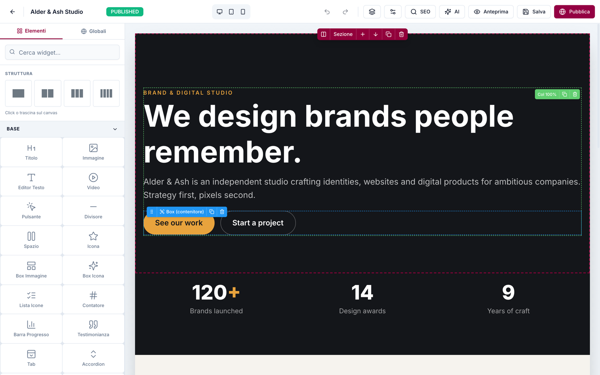
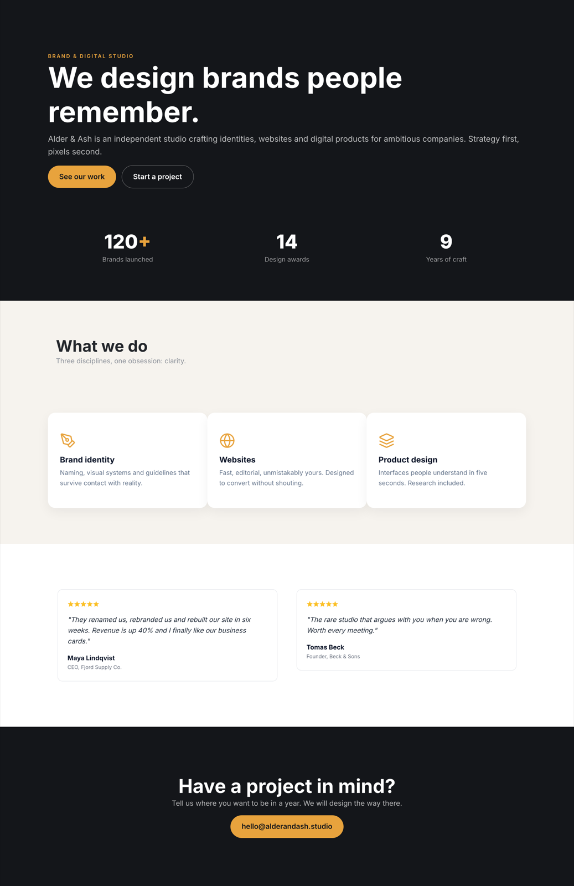

# Element Node

**The AI-agent CMS your clients can still edit visually.**

Element Node is an open-source visual CMS built on **Next.js 15 + Prisma/MySQL**. AI agents build entire sites on it — through the official **Claude Code skill** or the **MCP server** (Cursor, Windsurf, any MCP client) — and after the agent is done, the site stays in an **Elementor-style visual editor** that a non-technical client can safely use. Self-hosted: your server, your data.

> 🇮🇹 Documentazione in italiano: [elementnode.cloud/it/docs](https://elementnode.cloud/it/docs)



<details>
<summary>The same page, published (built end-to-end by an AI agent via the official skill)</summary>


</details>

## Quickstart

```bash
bash <(curl -fsSL https://elementnode.cloud/install.sh)
```

Requirements: Node.js ≥ 20, MySQL/MariaDB. The installer clones the repo, installs dependencies, creates `.env` and the DB schema, builds, and leaves you at the `/install` wizard (admin user, site, AI).

**Non-interactive mode** (for AI agents / provisioning): export `DB_NAME`, `DB_USER`, `DB_PASS`, `SITE_URL` (optional `DB_HOST`, `DB_PORT`) before running — no prompts. For Plesk see [PLESK_DEPLOY.md](PLESK_DEPLOY.md).

**One-prompt setup:** the entire path — server, CMS, skill and first site — can be driven by a single prompt pasted into Claude Code. Template: [elementnode.cloud/it/docs#prompt](https://elementnode.cloud/it/docs#prompt)

## Built for AI agents

| Integration | For | What it does |
|---|---|---|
| [Official skill](skill/) | Claude Code / Codex | Builds **entire sites**: from a brief, or pixel-perfect clones of existing sites verified by a visual-comparison agent (screenshot → diff → fix, until convergence) |
| [MCP server](mcp/) | Cursor, Windsurf, any MCP client | Pages, theme, media, full Site Blueprint import/export, always-fresh widget docs |
| REST API | Anything else | Bearer API keys with scopes (`site.import`, `site.export`, …) |

Real production numbers (agent build time, human review on top): a 24-page WordPress migration in **~1 hour** · a complete bilingual site in **half a day** · a React SPA cloned at **95/100** automated visual fidelity in ~2 hours. See [showcase](https://elementnode.cloud/en/showcase).

## What's in the box

- **Visual editor** — 3-panel Elementor-style UI: widget library · canvas · properties. Drag & drop, inline text editing, undo/redo, revisions, responsive preview, style controls (spacing, borders, shadows, gradients)
- **51 native widgets** — heading, text, button, image, video, icon-box, counters, tabs, accordion, gallery, contact form, posts grid, marquee, nav drawer, nested boxes…
- **Theme blocks** — global header/footer with display conditions + priority (per-URL-prefix → native **multilingual sites**)
- **Content** — pages (nested slugs), posts, **custom post types + taxonomies**, redirects, popups
- **Forms** — reusable form entities, submissions in DB, SMTP/Brevo delivery, GDPR consent fields
- **Privacy** — native cookie consent banner (variants per language, click-to-load embeds), site access modes (public / password / maintenance) with automatic noindex
- **AI built in** (bring your own Anthropic key) — editor chat that generates and edits sections, one-click SEO (title/description/keyword in the page's language)
- **SEO** — per-page meta, OG image, sitemap, robots, SEO score panel
- **Media** — local uploads, sharp-optimized thumbnails (WebP/AVIF), lazy loading
- **Ops** — **1-click self-update** from the panel (with automatic pre-update DB backup), multi-user roles, API keys, health endpoint
- **Performance** — React Server Components, standalone output, HTTP cache + ISR. No plugin ecosystem needed: it's all native

## Stack

Next.js 15 (App Router, standalone output) · Prisma + MySQL · NextAuth v5 · Tailwind · @dnd-kit · TipTap · sharp · Anthropic Claude (optional, BYO key)

## Architecture notes

- Public pages render through `PageRenderer` (RSC) with a responsive core (columns stack under 768px, opt-out per column)
- Content is a JSON tree: sections → columns → widgets (see [skill/element-node-builder/references/widget-reference.md](skill/element-node-builder/references/widget-reference.md))
- Site Blueprint import/export moves whole sites as JSON (merge or replace)
- License validation is fail-open: the CMS works without a license — a license activates managed updates, security patches and support ([pricing](https://elementnode.cloud/en/pricing))

## License

- **CMS core: [AGPL-3.0](LICENSE)** — free to use, self-host and modify. Building and running your own sites (or client sites) carries no obligations; the AGPL kicks in only if you modify the CMS and offer it to others as a service.
- **[Claude Code skill](skill/) and [MCP server](mcp/): MIT** — integrate freely.

Managed updates, security patches, priority support and the white-label agency tier are commercial: [elementnode.cloud/en/pricing](https://elementnode.cloud/en/pricing). For commercial licensing outside AGPL terms, get in touch.
